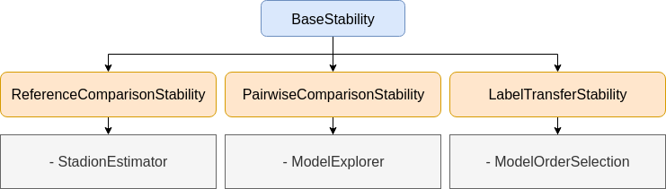

# skstab

**skstab** is a module for clustering stability analysis in Python with a scikit-learn compatible API.

## What is clustering stability?

Clustering stability is a method for model selection in clustering, based on the principle that if we repeatedly 
perturb a data set, a good clustering algorithm should output similar partitions. In particular, it allows to 
select the correct number of clusters in an unlabeled data set. See for example [4] for an overview.

## How to use skstab for model selection

The API is compatible with any clustering algorithm with an interface similar to scikit-sklearn, i.e. a 
`fit` method for training, and a `labels_` field or `predict` method to obtain cluster memberships.

skstab allows to build and tune a variety of stability estimation methods. As of today, three concrete methods are 
implemented and can be used off-the-shelf:

* **Model explorer** from Ben-Hur et al, 2002 [1]
* **Model order selection** from Lange et al, 2004 [2]
* **Stadion** from Mourer et al, 2020 [3]

Each method has a usage example script (simply run `example_modelexplorer.py`/`example_modelorderselection.py`/`example_stadion.py`).
Let us start with the K-means algorithm and Stadion [3], since it effectively selects the number of clusters K even in 
the case where data is not clusterable (i.e. K=1):

```python
from skstab import StadionEstimator
from skstab.datasets import load_dataset
from sklearn.cluster import KMeans

# 1. Load data
dataset = 'exemples2_5g' # example data set with 5 Gaussians
X, y = load_dataset(dataset)

# 2. Choose clustering algorithm
algorithm = KMeans
km_kwargs = {'init': 'k-means++', 'n_init': 10}  # algorithm settings

# 3. Fix range of parameters and Stadion hyperparameter omega
k_values = list(range(1, 11))  # evaluate K=1 to K=10
omega = list(range(2, 6))  # keep this fixed to 2:5 or 2:10

# 4. Define stability estimation class
stab = StadionEstimator(X, algorithm,
                        param_name='n_clusters',
                        param_values=k_values,
                        omega=omega,
                        extended=True,
                        runs=10,
                        perturbation='uniform',
                        perturbation_kwargs='auto',
                        algo_kwargs=km_kwargs,
                        n_jobs=-1)

# 5. Evaluate stability scores
score = stab.score(strategy='max', crossing=True)  # estimate Stadion scores
k_hat = stab.select_param()[0]  # selected number of clusters
```

The correct number of clusters (K=5) is selected. The example script `example_stadion.py` also outputs visualizations 
called _stability paths_, representing stability as a function of the level of perturbation (see 
[3] for more    details).

## Installation

`$ python3 setup.py install`

skstab was written for Python 3 and depends on joblib, matplotlib, numpy, pandas, scikit-learn and scipy.

## Architecture



## References

> [1] Ben-Hur, A., Elisseeff, A., & Guyon, I. (2002). A stability based method for discovering structure in clustered
    data. Pacific Symposium on Biocomputing. https://doi.org/10.1142/9789812799623_0002

> [2] Lange, T., Roth, V., Braun, M. L., & Buhmann, J. M. (2004). Stability-based validation of clustering solutions.
    Neural Computation. https://doi.org/10.1162/089976604773717621

> [3] Mourer, A., Forest, F., Lebbah, M., Azzag, H., & Lacaille, J. (2020). Selecting the Number of Clusters K with a
    Stability Trade-off: an Internal Validation Criterion. https://arxiv.org/abs/2006.08530

> [4] Von Luxburg, U. (2009). Clustering stability: An overview. Foundations and Trends in Machine Learning. https://doi.org/10.1561/2200000008

## To-do

* More examples and figures
